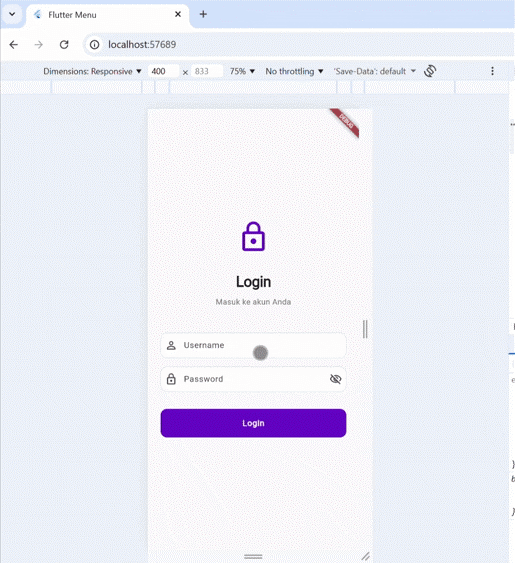
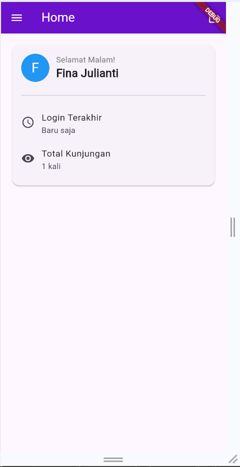
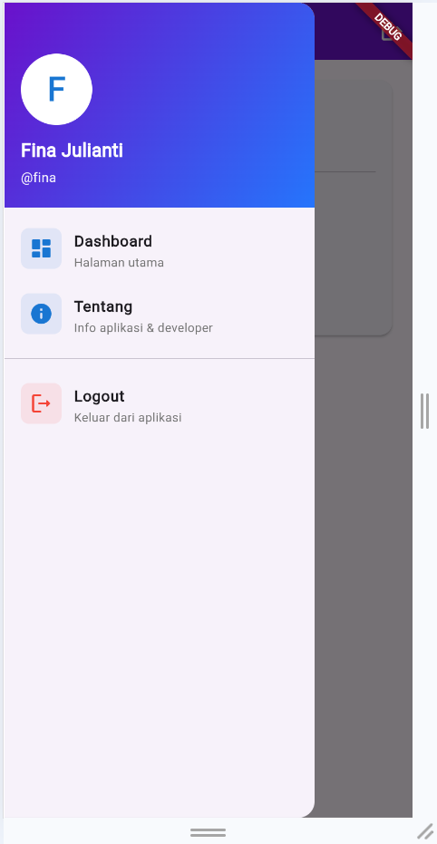
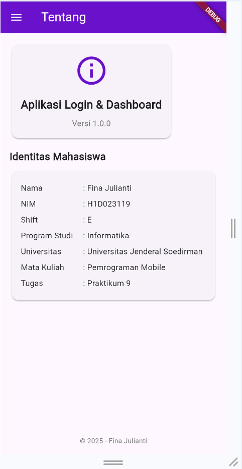

# 🎯 Aplikasi Login & Dashboard Flutter

**Tugas Praktikum 9 - Pemrograman Mobile**

---

## 👤 Identitas Mahasiswa

**Nama:** Fina Julianti  
**NIM:** H1D023119  
**Shift:** E  
**Program Studi:** Informatika  
**Universitas:** Universitas Jenderal Soedirman  
**Mata Kuliah:** Pemrograman Mobile

---


## 📸 Screenshot Aplikasi

### 1️⃣ Demo Aplikasi


**Deskripsi:** Demo interaktif aplikasi menampilkan seluruh fitur dari login hingga logout.

---

### 2️⃣ Halaman Login (Empty State)


**Deskripsi:** Halaman login dengan desain minimalist modern, menampilkan field username dan password.

---

### 3️⃣ Halaman Login (Filled)


**Deskripsi:** Contoh pengisian form login dengan password yang di-hide. Terdapat tombol visibility untuk toggle show/hide password.

---

### 4️⃣ Halaman Dashboard/Home


**Deskripsi:** Dashboard dengan greeting dinamis, informasi user, last login time, dan visit counter.

---

### 5️⃣ Side Menu/Drawer


**Deskripsi:** Navigation drawer dengan avatar user, informasi profil, dan menu navigasi ke berbagai halaman.

---

### 6️⃣ Halaman About


**Deskripsi:** Halaman about yang menampilkan informasi aplikasi dan identitas mahasiswa.

---

### 7️⃣ Logout Confirmation


**Deskripsi:** Dialog konfirmasi sebelum melakukan logout dari aplikasi.

---

## 🏗️ Struktur Proyek

```
h1d023119_tugas7/
├── lib/
│   ├── main.dart              # Entry point aplikasi
│   ├── login_page.dart        # Halaman login dengan multi-user auth
│   ├── home_page.dart         # Dashboard dengan fitur dinamis
│   ├── about_page.dart        # Halaman informasi aplikasi
│   └── sidemenu.dart          # Navigation drawer
├── screenshots/               # Folder untuk screenshot aplikasi
│   ├── demotugas7.gif
│   ├── login utama.png
│   ├── login field terisi.png
│   ├── homepage.png
│   ├── sidebar.png
│   ├── tentang.png
│   └── pop up konfirmasi logout.png
├── pubspec.yaml              # Dependencies & assets
└── README.md                 # Dokumentasi (file ini)
```

---

## 🔍 Penjelasan Kode Per File

### 1️⃣ `main.dart` - Entry Point

```dart
import 'package:flutter/material.dart';
import 'package:prakpert9/login_page.dart';

void main() {
  runApp(const MyApp());
}

class MyApp extends StatelessWidget {
  const MyApp({super.key});

  @override
  Widget build(BuildContext context) {
    return MaterialApp(
      title: 'Prakpert 9',
      theme: ThemeData(
        colorScheme: ColorScheme.fromSeed(seedColor: Colors.deepPurple),
        useMaterial3: true,
      ),
      home: const LoginPage(),
    );
  }
}
```

**Penjelasan:**
- `main()` adalah fungsi utama yang dijalankan pertama kali
- `MyApp` adalah root widget aplikasi
- `MaterialApp` mengatur konfigurasi tema dan routing
- `home: LoginPage()` menetapkan halaman login sebagai halaman pertama yang ditampilkan

---

### 2️⃣ `login_page.dart` - Sistem Autentikasi

**Fitur Utama:**
- Multi-user authentication dengan 4 akun demo
- Password visibility toggle (show/hide)
- Input validation
- Loading state saat proses login
- Error handling dengan dialog informatif
- Penyimpanan data user ke SharedPreferences

**Kode Penting:**

#### A. State Variables & User Data
```dart
class _LoginPageState extends State<LoginPage> {
  final TextEditingController _usernameController = TextEditingController();
  final TextEditingController _passwordController = TextEditingController();
  bool _isPasswordVisible = false;
  bool _isLoading = false;
  
  // Multiple user accounts untuk demonstrasi
  final Map<String, Map<String, String>> _users = {
    'fina': {'password': 'fina123', 'fullName': 'Fina Julianti'},
    'admin': {'password': 'admin123', 'fullName': 'Administrator'},
    'user': {'password': 'user123', 'fullName': 'Regular User'},
    'guest': {'password': 'guest123', 'fullName': 'Guest User'},
  };
```
**Penjelasan:**
- `_usernameController` & `_passwordController` untuk menangkap input user
- `_isPasswordVisible` untuk toggle show/hide password
- `_isLoading` untuk menampilkan loading indicator
- `_users` Map menyimpan data akun yang valid (username, password, fullName)

---

#### B. Save User Data ke Local Storage
```dart
void _saveUsername(String fullName) async {
  SharedPreferences prefs = await SharedPreferences.getInstance();
  prefs.setString('username', _usernameController.text);
  prefs.setString('fullName', fullName);
  prefs.setString('lastLogin', DateTime.now().toString());
}
```
**Penjelasan:**
- `SharedPreferences` untuk menyimpan data secara lokal di device
- Menyimpan `username`, `fullName`, dan `lastLogin` timestamp
- Data ini akan digunakan di halaman home untuk personalisasi

---

#### C. Input Field dengan Toggle Password
```dart
_showInput(namacontroller, placeholder, isPassword) {
  return TextField(
    controller: namacontroller,
    obscureText: isPassword && !_isPasswordVisible,
    decoration: InputDecoration(
      hintText: placeholder,
      filled: true,
      fillColor: Colors.grey[100],
      border: OutlineInputBorder(
        borderRadius: BorderRadius.circular(12),
        borderSide: BorderSide.none,
      ),
      prefixIcon: Icon(
        isPassword ? Icons.lock_outline : Icons.person_outline,
        color: Colors.blue,
      ),
      suffixIcon: isPassword
          ? IconButton(
              icon: Icon(
                _isPasswordVisible ? Icons.visibility : Icons.visibility_off,
                color: Colors.grey,
              ),
              onPressed: () {
                setState(() {
                  _isPasswordVisible = !_isPasswordVisible;
                });
              },
            )
          : null,
    ),
  );
}
```
**Penjelasan:**
- `obscureText: isPassword && !_isPasswordVisible` - password di-hide kecuali user klik icon visibility
- `suffixIcon: IconButton` - tombol toggle untuk show/hide password
- `setState()` - memicu rebuild UI saat visibility berubah
- Desain modern dengan rounded corners dan filled background

---

#### D. Proses Login dengan Validasi
```dart
void _login() {
  String username = _usernameController.text.trim().toLowerCase();
  String password = _passwordController.text;

  // Validasi input kosong
  if (username.isEmpty || password.isEmpty) {
    _showErrorDialog('Username dan Password tidak boleh kosong!');
    return;
  }

  // Set loading state
  setState(() {
    _isLoading = true;
  });

  // Simulasi delay untuk user experience
  Future.delayed(const Duration(seconds: 1), () {
    setState(() {
      _isLoading = false;
    });

    // Cek kredensial
    if (_users.containsKey(username) &&
        _users[username]!['password'] == password) {
      String fullName = _users[username]!['fullName']!;
      _saveUsername(fullName);
      _showSuccessDialog('Login Berhasil!', 'Selamat datang, $fullName', const HomePage());
    } else {
      _showErrorDialog('Username atau Password salah!\n\nHint: coba username: fina, password: fina123');
    }
  });
}
```
**Penjelasan:**
- Validasi input kosong sebelum proses login
- `trim()` menghapus spasi, `toLowerCase()` untuk case-insensitive
- Loading state dengan `Future.delayed()` untuk simulasi network call
- Pengecekan kredensial dengan `Map.containsKey()` dan validasi password
- Jika sukses: simpan data & navigate ke HomePage
- Jika gagal: tampilkan error dialog dengan hint

---

### 3️⃣ `home_page.dart` - Dashboard Dinamis

**Fitur Utama:**
- Dynamic greeting berdasarkan waktu (pagi/siang/sore/malam)
- Menampilkan nama lengkap user dari SharedPreferences
- Last login time dengan format relatif (X menit/jam/hari yang lalu)
- Visit counter (menghitung berapa kali user masuk)
- Quick action buttons
- Profile dialog
- Logout functionality

**Kode Penting:**

#### A. Load User Data dari SharedPreferences
```dart
class _HomePageState extends State<HomePage> {
  String _username = '';
  String _fullName = '';
  String _lastLogin = '';
  int _visitCount = 0;

  @override
  void initState() {
    super.initState();
    _loadUserData();
  }

  void _loadUserData() async {
    SharedPreferences prefs = await SharedPreferences.getInstance();
    setState(() {
      _username = prefs.getString('username') ?? 'User';
      _fullName = prefs.getString('fullName') ?? 'Guest';
      _lastLogin = prefs.getString('lastLogin') ?? '';
      _visitCount = prefs.getInt('visitCount') ?? 0;
    });
    
    // Increment visit count
    _visitCount++;
    prefs.setInt('visitCount', _visitCount);
  }
}
```
**Penjelasan:**
- `initState()` dipanggil sekali saat widget pertama kali dibuat
- Mengambil data user yang disimpan saat login
- Increment dan update visit counter setiap kali halaman dibuka
- `setState()` untuk update UI dengan data yang di-load

---

#### B. Dynamic Greeting Berdasarkan Waktu
```dart
String _getGreeting() {
  var hour = DateTime.now().hour;
  if (hour < 12) {
    return 'Selamat Pagi';
  } else if (hour < 15) {
    return 'Selamat Siang';
  } else if (hour < 18) {
    return 'Selamat Sore';
  } else {
    return 'Selamat Malam';
  }
}
```
**Penjelasan:**
- Mendapatkan jam sekarang dengan `DateTime.now().hour`
- Logic sederhana berdasarkan range waktu:
  - 00:00 - 11:59 → Pagi
  - 12:00 - 14:59 → Siang
  - 15:00 - 17:59 → Sore
  - 18:00 - 23:59 → Malam

---

#### C. Format Last Login (Relative Time)
```dart
String _formatLastLogin() {
  if (_lastLogin.isEmpty) return 'Baru saja';
  try {
    DateTime loginTime = DateTime.parse(_lastLogin);
    Duration diff = DateTime.now().difference(loginTime);
    
    if (diff.inMinutes < 1) {
      return 'Baru saja';
    } else if (diff.inMinutes < 60) {
      return '${diff.inMinutes} menit yang lalu';
    } else if (diff.inHours < 24) {
      return '${diff.inHours} jam yang lalu';
    } else {
      return '${diff.inDays} hari yang lalu';
    }
  } catch (e) {
    return 'Baru saja';
  }
}
```
**Penjelasan:**
- Parse string timestamp menjadi DateTime object
- Hitung selisih waktu dengan `DateTime.now().difference()`
- Format dalam satuan yang sesuai (menit/jam/hari)
- Error handling dengan try-catch

---

#### D. Logout dengan Confirmation Dialog
```dart
void _logout() async {
  showDialog(
    context: context,
    builder: (context) => AlertDialog(
      title: const Text('Konfirmasi Logout'),
      content: const Text('Apakah Anda yakin ingin keluar?'),
      actions: [
        TextButton(
          onPressed: () => Navigator.pop(context),
          child: const Text('Batal'),
        ),
        ElevatedButton(
          style: ElevatedButton.styleFrom(backgroundColor: Colors.red),
          onPressed: () async {
            SharedPreferences prefs = await SharedPreferences.getInstance();
            await prefs.remove('username');
            await prefs.remove('fullName');
            Navigator.pushAndRemoveUntil(
              context,
              MaterialPageRoute(builder: (context) => const LoginPage()),
              (route) => false,
            );
          },
          child: const Text('Logout'),
        ),
      ],
    ),
  );
}
```
**Penjelasan:**
- Dialog konfirmasi untuk mencegah logout tidak sengaja
- Hapus data user dari SharedPreferences
- `Navigator.pushAndRemoveUntil()` - navigate ke login dan hapus semua history
- `(route) => false` - clear semua route stack

---

### 4️⃣ `about_page.dart` - Informasi Aplikasi

Halaman about menampilkan informasi lengkap tentang aplikasi, identitas mahasiswa, daftar fitur, dan tech stack yang digunakan dengan desain modern menggunakan gradient backgrounds dan card-based layout.

---

### 5️⃣ `sidemenu.dart` - Navigation Drawer

Navigation drawer dengan custom header yang menampilkan avatar user, nama lengkap, dan username. Menu items dengan icons dan subtitles untuk navigasi ke berbagai halaman.

---

## 🔄 Alur Data & Navigasi

### Login Flow:
```
LoginPage (login_page.dart)
    ↓
[User input username & password]
    ↓
[Validasi input tidak boleh kosong]
    ↓
[Cek kredensial di Map _users]
    ↓
[Jika valid: Simpan ke SharedPreferences]
    ↓
[Navigate ke HomePage]
```

### Data Passing dengan SharedPreferences:
```dart
// Saat Login (login_page.dart):
SharedPreferences prefs = await SharedPreferences.getInstance();
prefs.setString('username', 'fina');
prefs.setString('fullName', 'Fina Julianti');
prefs.setString('lastLogin', DateTime.now().toString());

// Saat Load di HomePage (home_page.dart):
SharedPreferences prefs = await SharedPreferences.getInstance();
String username = prefs.getString('username') ?? 'User';
String fullName = prefs.getString('fullName') ?? 'Guest';
```

**Kenapa pakai SharedPreferences?**
- Data persisten (tidak hilang saat app ditutup)
- Cocok untuk data sederhana (key-value pairs)
- Mudah digunakan untuk session management
- Built-in encryption di production mode


